<a href="https://sharann.dev"><picture><source media="(prefers-color-scheme: dark)" srcset="https://img.shields.io/badge/PORTFOLIO-0d1117?style=flat-square&logoColor=ffffff"/></picture></a>
<a href="https://sharann.dev/Resume.pdf"><picture><source media="(prefers-color-scheme: dark)" srcset="https://img.shields.io/badge/RESUME-0d1117?style=flat-square&logo=adobeacrobatreader&logoColor=ffffff"/></picture></a>
<a href="https://linkedin.com/in/sharannm"><picture><source media="(prefers-color-scheme: dark)" srcset="https://img.shields.io/badge/LINKEDIN-0d1117?style=flat-square&logo=linkedin&logoColor=ffffff"/></picture></a>
<a href="https://x.com/m_sharann"><picture><source media="(prefers-color-scheme: dark)" srcset="https://img.shields.io/badge/X-0d1117?style=flat-square"/></picture></a>
<a href="mailto:sharannmanojkumar@gmail.com"><picture><source media="(prefers-color-scheme: dark)" srcset="https://img.shields.io/badge/EMAIL-0d1117?style=flat-square"/></picture></a>

<picture>
  <source media="(prefers-color-scheme: dark)" srcset="https://github-readme-stats.vercel.app/api?username=Sharann-del&show_icons=true&hide_border=true&border_radius=0&bg_color=00000000&title_color=ffffff&text_color=ffffff&icon_color=ffffff&ring_color=ffffff&include_all_commits=true&count_private=true&rank_icon=github"/>
  
</picture>
<picture>
  <source media="(prefers-color-scheme: dark)" srcset="https://github-readme-stats.vercel.app/api/top-langs/?username=Sharann-del&layout=compact&hide_border=true&border_radius=0&bg_color=00000000&title_color=ffffff&text_color=ffffff&langs_count=8"/>
  
</picture>

<picture>
  <source media="(prefers-color-scheme: dark)" srcset="https://github-readme-activity-graph.vercel.app/graph?username=Sharann-del&bg_color=00000000&color=ffffff&line=ffffff&point=ffffff&area_color=ffffff&area=true&hide_border=true&radius=0&custom_title=CONTRIBUTION%20TELEMETRY"/>
  
</picture>

<!-- adaptive monochrome SVG system · motion respects prefers-reduced-motion -->
